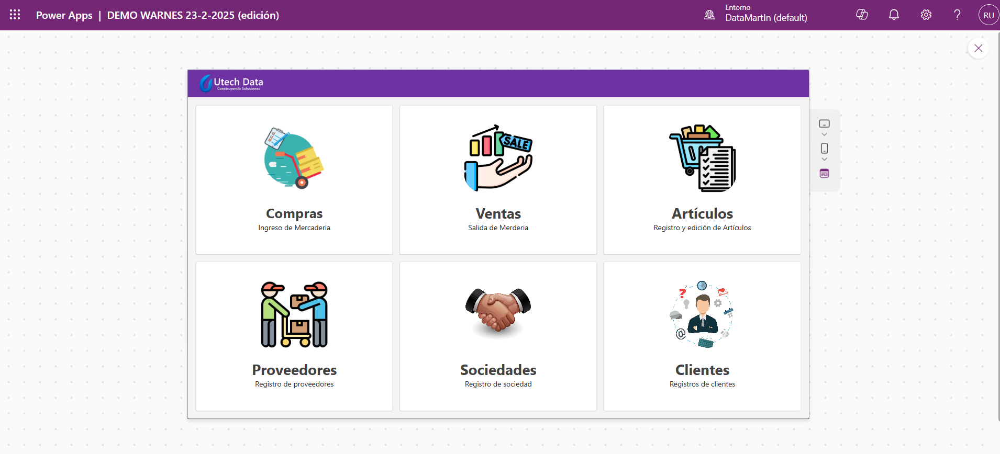
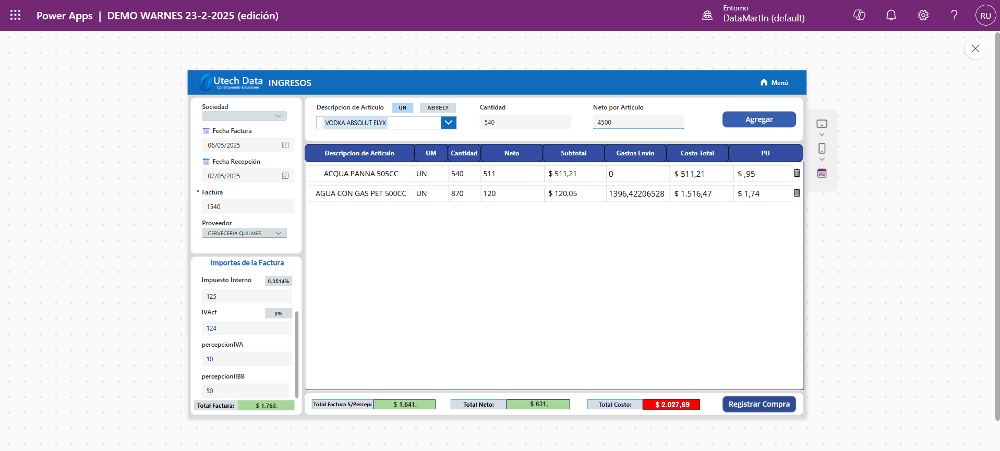
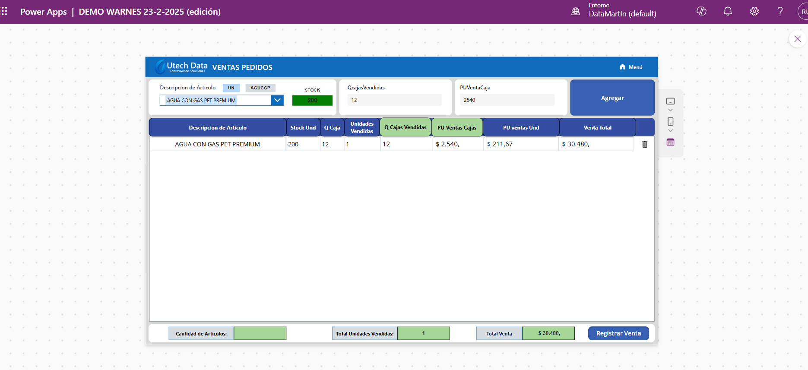

# 📱 Aplicación de Registro y ventas en Power Apps

Esta aplicación la desarrollé en **Microsoft Power Apps** con el objetivo de digitalizar el proceso completo de **gestión de stock, compras, ventas y proveedores**, para un empresa de venta de alimentos y licores.

---

## 🏠 Menú Principal

La pantalla inicial ofrece un acceso rápido a las seis funcionalidades principales:
- **Compras**: Ingreso de mercadería por proveedor.
- **Ventas**: Registro de salida de stock por cliente.
- **Artículos**: Gestión centralizada de productos.
- **Proveedores**: Alta y consulta de proveedores.
- **Sociedades**: Segmentación por empresa.
- **Clientes**: Registro de clientes finales.

---

## 🛒 Registro de Compras

Esta pantalla permite:
- Ingresar una **factura con su fecha, proveedor y sociedad asociada**.
- Agregar artículos indicando **cantidad y precio neto**.
- Cálculo automático de:
  - **Subtotal**
  - **Gastos de envío**
  - **Impuestos internos, IVA, percepciones**
  - **Costo total de la factura**

Se valida la integridad entre los totales ingresados manualmente y los calculados automáticamente. Además, el botón **Registrar Compra** guarda todos los detalles.

---

## 📦 Registro y edición de Artículos

Desde esta pantalla se pueden:
- Crear nuevos productos con código único, unidad de medida, impuesto, tipo de contenido y hasta una imagen.
- Editar y eliminar artículos existentes.
- Buscar productos con autocompletado.
- Asignar múltiples atributos útiles para gestión de stock, como **contenido por unidad**, **versión** o **clasificación**.

---

## 💰 Registro de Ventas

Este módulo permite:
- Buscar un artículo y validar su **stock disponible**.
- Registrar ventas en cajas o unidades.
- Calcular automáticamente:
  - **Unidades vendidas**
  - **Precio unitario**
  - **Total de la venta**
- Mostrar métricas de resumen:
  - Total de artículos, unidades y monto vendido.

El botón **Registrar Venta** guarda la operación y descuenta el stock automáticamente.

---

## 🧠 Funcionalidades implementadas

- Validación de stock en tiempo real antes de permitir la venta.
- Registro de múltiples artículos por factura de compra.
- Cálculo dinámico de precios, impuestos y costos.
- Arquitectura escalable pensada para integración con SQL Server o Dataverse.

